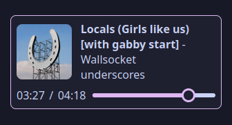
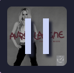

I recently had an idea for a project: I wonder if it's possible for me to display what music I'm currently listening to on my website?  
(Spoiler: it is! Although it might just say "Currently offline" depending on when you're reading this)

<p class="music-display-container">
	<music-display nowPlayingApi="https://music-player.mck.is/now-playing" websocketUrl="wss://music-player.mck.is/now-playing-ws">
	</music-display>

  <script src="https://music-player.mck.is/musicDisplayComponent.js"></script>
</p>

Why? It sounded like a nice, short project, I think it's fun showing off what music I like, and I've had it displayed as my discord status for a while now, which gets friends talking about music!


So I started thinking over the minimum parts I'd need to get working:

- Something on my website to display the currently playing song
- A server of some sort for me to send what music I'm listening to to
- Some way to get or send what music I'm playing

I already knew MusicBee (the music player I normally use on desktop) had some sort of plugin system, since it's already how I was sharing what I was listening to on Discord - presumably I should be able to do something similar, just sending the data to my website instead?

Thankfully the [MusicBee website](https://www.getmusicbee.com/help/api/) has at least some documentaion on the plugin API, the requirements for it (targeting .NET Framework 4.0), and an interface for all the methods it supports.  
Mildly annoying for me that it's .NET Framework (the version that only runs on windows) as I usually use linux, but I can easily switch to windows for compiling and testing the plugin, it should still run fine through wine later on. (Also getting to use more C# was nice, I've been enjoying it a lot recently!)

Some quick browsing through the provided `MusicBeeApiInterface` and DiscordBee's source code, I found the methods I'd need for getting info about the currently playing song, and how to received notifications when the song changes - it was all pretty nice to use! It also provided the album art as a base64 encoded string, which made it even easier for me to test sending stuff to the server.

```csharp
var playingData = new
{
	Artist = _mbApiInterface.NowPlaying_GetFileTag(MetaDataType.Artist),
	Title = _mbApiInterface.NowPlaying_GetFileTag(MetaDataType.TrackTitle),
	Album = _mbApiInterface.NowPlaying_GetFileTag(MetaDataType.Album),
	DurationMs = _mbApiInterface.NowPlaying_GetDuration(),
	PositionMs = _mbApiInterface.Player_GetPosition(),
	PlayState = _mbApiInterface.Player_GetPlayState(),
	AlbumArt = _mbApiInterface.NowPlaying_GetArtwork()
};

using var client = new System.Net.WebClient();
client.UploadString("http://localhost:3000", "POST", JsonConvert.SerializeObject(playingData));
```

For the server, I decided to just quickly throw it together using [Bun](https://bun.sh), since I've found javascript(/typescript) to be perfect for this scale of project. (I chose Bun over NodeJS only because I wanted to try out its `Bun.serve` API, I really hope this server will never be under enough load for any performance differences to matter)  
To test that the idea worked at all, I told it to just log anything it received.

```typescript
Bun.serve({
	port: 3000,
	async fetch(req) {
		const body = (await req.json()) as PlayingData;

		console.table({
			...body,
			playState: PlayState[body.playState], // number -> string
			albumArt: "base64 encoded", // way too long to log
		});

		const buffer = Buffer.from(body.albumArt, "base64");
		Bun.write("albumArt.jpg", buffer);

		return new Response();
	},
});
```

<p>
	<video controls>
		<source src="/blog/initial-music-prototype.mp4"></source>
	</video>
</p>

We've proven the concept!

But I'm still missing some way to display this on my website. There's so many different toolkits/frameworks/etc. I could pick do this with (svelte, react, htmx, vue, angular, solid, etc, etc.), but to get started I'll just use vanilla JS and CSS, to fetch the data from the server, and update the DOM with it.

```javascript
setInterval(() => {
	const response = await fetch("http://localhost:3000/now-playing");
	const playingData = await response.json();

	document.getElementById("albumArt").src = `data:image/png;base64, ${playingData.albumArt}`;

	document.getElementById("songTitle").innerText = playingData.title;
	document.getElementById("album").innerText = ` - ${playingData.album}`;

	document.getElementById("artist").innerText = playingData.artist;

	let position = document.getElementById("position");
	position.innerText = new Date(playingData.positionMs).toISOString().substr(14, 5);

	let duration = document.getElementById("duration");
	duration.innerText = new Date(playingData.durationMs).toISOString().substr(14, 5);

	let progressBar = document.getElementById("progressBar");
	progressBar.value = playingData.positionMs;
	progressBar.max = playingData.durationMs;
}, 10);
```

<p>
	<video controls>
		<source src="/blog/initial-music-web-ui.mp4"></source>
	</video>
</p>

Looking good!

However this initial solution isn't great - polling the server every 10 milliseconds is more than a bit excessive, but I still want it to update quickly.  
I'd heard of websockets before but didn't know much about them - after a bit of reading (MDN is fantastic), they seemed pretty much perfect! I can just have the server send the data to the client whenever it changes, and the client can update the DOM then.

```javascript
const webSocket = new WebSocket("ws://localhost:3000/now-playing-ws");

webSocket.onmessage = (event) => {
	fullUpdate(JSON.parse(event.data));
};
```

But this meant the progress indicator only updated when the song changed or I manually moved to a different part of the song. `setInterval` again to position it would definitely have worked, but I felt like it'd be more interesting to try to understand CSS animations a bit better and animate progress with it instead. After quite a bit of fiddling around, I figured out that setting a negative `animation-delay` would allow me to position the marker at the currently correct position, and animate over time to the end of the song.

```js
seekBarPositionMarker.style.animation = `moveRight ${playingData.durationMs}ms linear -${currentPosition}ms forwards`;
```

Perfect! With a bit of extra polish, the whole thing looks pretty good.


I decided to try out CSS nesting for this, as of a couple months ago it's [supported in all major browsers](https://caniuse.com/css-nesting). Which helps keep the CSS a bit more organised and readable:

```css
#artContainer {
	position: relative;
	height: 100%;
	width: var(--albumArtSize);
	display: flex;
	justify-content: center;
	align-items: center;

	#pauseSymbol {
		width: var(--albumArtSize);
		height: var(--albumArtSize);
		filter: drop-shadow(5px 5px 2px var(--base));
		display: none;

		&.paused {
			display: block;
		}
	}

	#albumArt {
		width: var(--albumArtSize);
		max-height: var(--albumArtSize);
		border-radius: var(--border-radius);

		&.paused {
			filter: grayscale(70%) brightness(70%);
		}
	}
}
```

CSS variables are great! I don't see them used often enough.

And then a bit more work after I realised it should probably look good when squished down on mobile too:



CSS Grid turned out to be a great help for this - I've never actually used it before, but now I have a decent understanding of how they work, and can't wait to use them more.

<section>

As a side-note, I found a tiny odd difference between Firefox and Chromium. I was using an SVG for the pause button, and decided to use some css variables to define how rounded the corners should be (`rx="calc(var(--border-radius) / 2)"`).  
Firefox logs a warning saying `Unexpected value` but still renders it the way I intended:


While Chromium logs an error and renders it with sharp corners:



I have no idea which one is "correct" (or if there even is an answer to that), but I found it odd since they both support CSS variables for the `fill` without any issues.

</section>

I still needed to host this server I'd made somewhere - I decided rather than tying myself to a specific cloud provider and potentially dealing with issues from that in the future, I'd just host it on the cheapest Hetzner cloud instance. (I've been using their servers for a couple of years now an not had any issues yet, and their stuff is actually reasonably priced)

I also decided to use this as a chance to try out NixOS on a server, and use Caddy instead of Nginx for the reverse proxy. I honestly can't beleive how simple this was to set up compared to anything I've done with Nginx in the past, it was just a few lines in my `configuration.nix`:

```nix
services.caddy = {
	enable = true;
	email = "...";
	virtualHosts."music-player.mck.is" = {
		extraConfig = ''
			reverse_proxy localhost:3000
		'';
	};
};
```

(And then wondering why it wasn't working for a few minutes before realising I'd forgotten about DNS)

The final thing I wanted to do was to make it so I could easily add this to any page on my website, ideally without having to copy and paste a bunch of JS and CSS around, or having to worry about how to keep the display on my website when I decide to change my website's tech stack in a few years. I landed on using a web component for this - I'd used them a little before and even though I feel like their implementation could be quite a bit better, I still really love the idea of them.
This means all I need to do to add it to any page is:

```html
<music-display
	nowPlayingApi="https://music-player.mck.is/now-playing"
	websocketUrl="wss://music-player.mck.is/now-playing-ws">
</music-display>

<script src="https://music-player.mck.is/musicDisplayComponent.js"></script>
```

<style>
	music-display {
		display: flex;
		--base: #181926;
	}

	.music-display-container {
		display: flex;
		justify-content: center;
	}
</style>

<p class="music-display-container">
	<music-display nowPlayingApi="https://music-player.mck.is/now-playing" websocketUrl="wss://music-player.mck.is/now-playing-ws">
	</music-display>

  <script src="https://music-player.mck.is/musicDisplayComponent.js"></script>
</p>

And we're done!

Both the [MusicBee plugin](https://github.com/James-McK/PostPublicMusicPlugin) and [server + web component](https://github.com/James-McK/PostPublicMusicReceiver) are open source, so feel free to take a look! You can see some of the stuff I skipped over here, like resizing the album art so I'm not trying to POST megabytes of JSON, or adding authentication to the server. You could even host it yourself, if you wanted to for some reason? (I'm not really sure why I did this, so I'm not sure why you would either)

I'm really happy with how this whole project turned out! It went extremely (and unusually) smoothly, I managed to learn quite a bit anyway, and had fun putting the whole thing together. I also have some ideas for doing more with this in the future, but I'm also happy calling it "done" in its current state.
