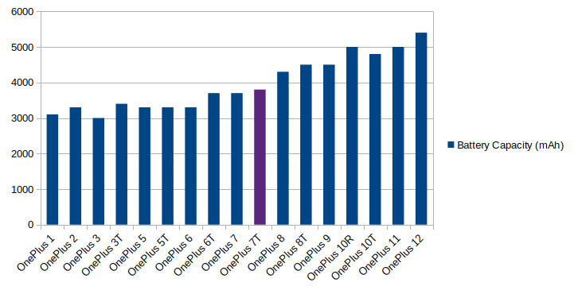
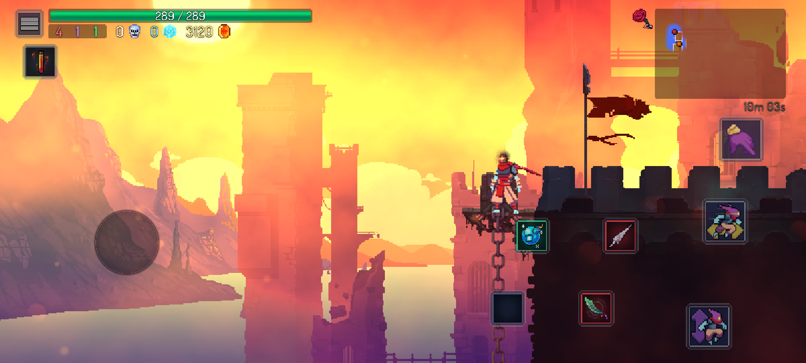
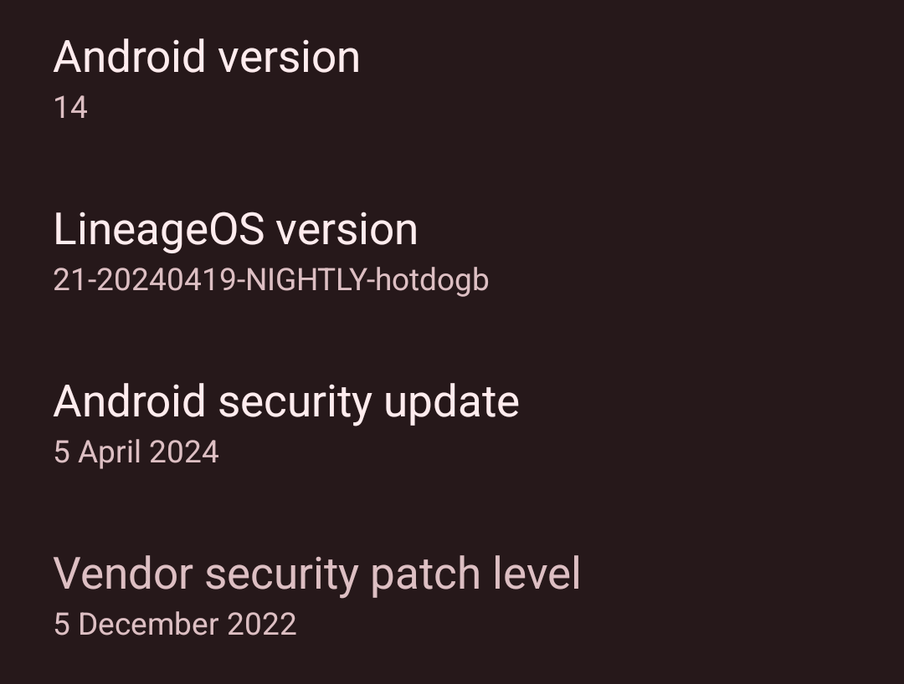

Recently my Flip 4, which I'd been using for about a year, stopped charging, claiming the "temperature was too low". So before sending it in to be repaired (before it being returned with them saying the battery/charging port issue couldn't be fixed under warrenty, as the screen had some tiny cracks in it??), I switched everything back to my OnePlus 7t, which I'd kept around in case something like this happened.

This also prompted me to check in on the current state of phones, to see what, if anything, had changed since the 7t was released back in September 2019 (nearly 5 years ago at time of writing!). I was surprised to see how little had changed!

The 7t was £550 when it launched (equivilant to about £680 today), it's not as if it was extremely expensive relative to other phones at the time - the S10 launched at £800 the same year.

## Hardware

### Screens

The 90Hz screen of the 7t is still amazingly smooth. 120Hz is becoming more common now, and is marginally smoother - I can spot the difference if I have the two side by side, but it's such a small diference I don't think it's worth the battery life.

Most phone screens are also still beautiful OLEDs of some type or another - high dynamic range, good viewing angles, vibrant colours. If you have a phone, it's very likely it has the best screen you have access to.

Screen resolution increases are far beyond the point of diminishing returns and just at the point of not being noticable at all. Even with the current phone sizes, 1080p is more than enough for individual pixels to not be noticable. It's nice that it seems most new phones are chosing not to waste money and battery life to go above this.

Phone bezels are about as tiny as they were, with great screen-to-body ratios.

### Cameras

These days, software is a much more important part of how photos look. The cameras themselves still have about the same resolution, although improvements like a larger sensor and optical zoom can still be made.

They definitely have continued to improve over time, but my 7t is still more than capable enough for whatever random photos I feel like taking.

Compared to photos from the flip 4, I really can't tell if it's better or not? Both can take fantastic photos, which is good enough for me!

(It bothers me that the flowerbed in this photo is off-centre, I'll try to retake it this summer)

### Batteries

Battery capacities have increased over time, but the changes have been fairly small and incremental. Using OnePlus as an example

There's not really anything exciting here. Nice to have, but hardly worth releasing nearly 2 phones every year for.

### Aesthetics

On the outside, phones haven't changed much. They're still flat rectangles, a mixture of glass and either metal or plastic, with camera bumps changing shape and jumping around. Some phones are experimenting with folding in various directions, but having tried the flip 4 myself, it feels more like a slightly inconvenient gimmick rather than a useful feature.

Phones keep alternating between rounded and flat edges, so there can at least be some visual difference between phone generations, but whichever you prefer is just personal preference.

Front cameras are still in either a teardrop or pinhole at best - at some point, under-screen cameras will likely become more common, but it's not enough of a change for me to look forward to.

### Performance

CPU and GPU performance and memory have kept increasing, but none of it enables any new use for phones. My 5 year old phone is still perfectly capable of displaying everything smoothly at 90Hz, with no hitches or slowdowns. Maybe those specs still matter if you're playing some intensive 3d game on your phone, but the only "mobile" games I've wanted to play have been Slay the Spire and Dead Cells (Both excellent games! and ported well to mobile)

(The easiest way to make any android phone feel snappier is to set the animation scales to 0.5x in developer settings - I honestly feel like this should be the default)

### Other

Most phones today are equally lacking in a headphone jack compared to the 7t :(

Even the need for storage has significantly slowed down - the base 128gb my 7t came with is plenty for my 34gb of music, and 21gb of all my photos and videos from the last decade.

## Software

Thanks to all the volunteers who contribute to [LineageOS](https://lineageos.org/), my phone from 5 years ago runs Android 14, and the most recent security patch.

Compared to the updates from OnePlus themselves, which:

- Usually took months to release
- Frequently introduces more bugs which were never later fixed (e.g. split-screening apps broke with the update to either Android 11 or 12)
- Only received 2 major Android updates (10 -> 12)

It's a shame that such a great phone was just abandoned by the manufacturer, when it's capable of lasting much longer.

## So?

In my opinion, this is actually a good thing. It means manufacturers are having to focus on providing longer-term support for their devices (e.g. at the start of this year, samsung announced they'd extend their android and security updates to 7 years). Hopefully this will also lead to less e-waste, with people replacing their devices less frequently.

However, what also needs to happen is for phones to become more repairable. Fairphone have proven this is doable. Replacing a battery or screen should be as easy as possible.

At some point in the future, phones will likely change or be replaced in some way that actually allows them to do something that they can't currently, but I don't see that happening any time soon. It's not folding phones, and it's definitely not an "AI" wearable computer pin.

Until then, at 5 years old my phone isn't feeling old at all.
