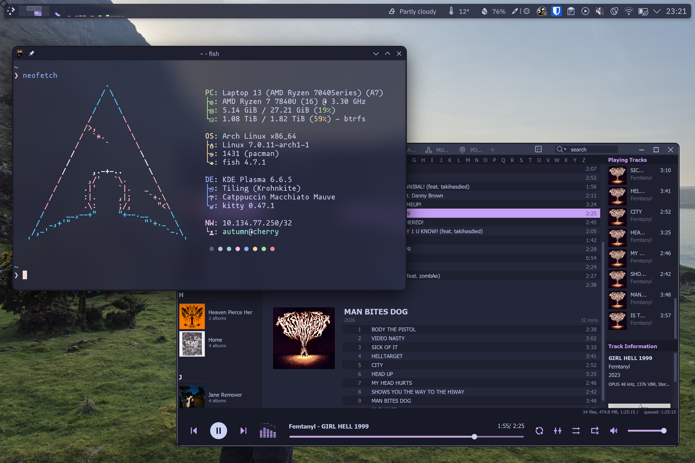
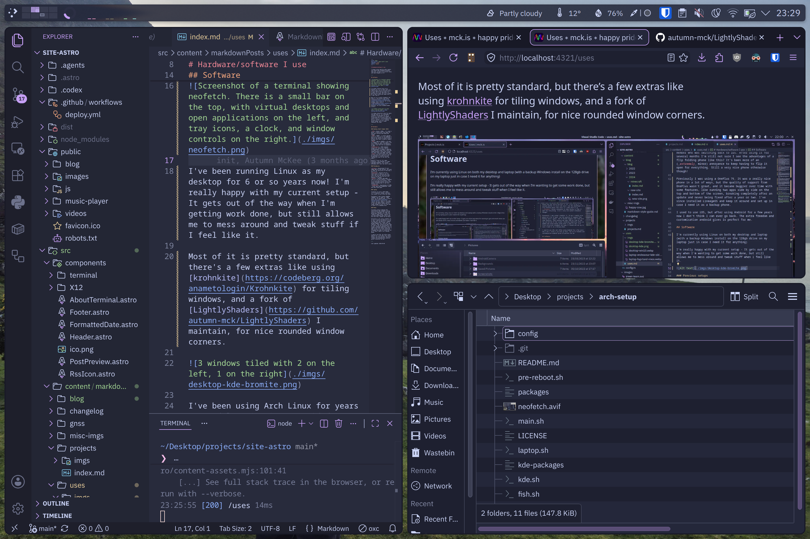

# Hardware/software I use

I always enjoy hearing other people talk about what hardware/software they use, so here's my current setup and some thoughts on it!

---

## Software

I've been running Linux as my desktop for 6 or so years now! I'm really happy with my current setup - It gets out of the way when I'm getting work done, but still allows me to mess around and tweak stuff if I feel like it.

Most of it is pretty standard, but there's a few extras like using [krohnkite](https://codeberg.org/anametologin/Krohnkite) for tiling windows, and a fork of [LightlyShaders](https://github.com/autumn-mck/LightlyShaders) I maintain, for nice rounded window corners.

I've been using Arch Linux for years now and love it, it's provided a reliable rolling base for me to build on in any way I've needed. I tried NixOS for a couple years and while I love it, it's ultimately not for me. My VPS is still running NixOS though, and it's been fantastic for that!

---

## Hardware

### Laptop

Framework 13 with an AMD 7840U - it's a fantastic laptop and helped me a lot in my last year of university, and has been wonderful to keep using since. I much prefer its 3:2 display, the keyboard has been one of my favourites on a laptop (not especially amazing, but nice to be typing on for hours). It's good to have a laptop that doesn't feel as if it's trying to fight you whenever you need to disassemble it.

Previously I had a Lenovo IdeaPad 14ARE05 I got in 2020 for ~£400, which was an amazing deal. The only reason I replaced it was that 8GB of memory was no longer enough for me, so I was able to give it to somebody else.

### Phone

Currently using a Samsung S24, admittedly a standard, boring choice. Using Nova Launcher as I love the "Swipe to open folder" feature (If you know anything open source that also has this, please let me know!)

Previously I was using a OnePlus 7t. It was a really nice phone in a lot of ways, but the quality of support from OnePlus wasn't great, and it became buggier over time with some features, like running two apps side by side on the top and bottom of the screen, breaking completely after an update and never being fixed after a year or two. I've since installed LineageOS and keep it around and set up in case I need it as a backup phone.

I used to use iOS, but after using Android for a few years now I don't think I can ever go back. The extra freedom and customisation android gives is perfect for me.

---

Last updated: 2026-06-05
