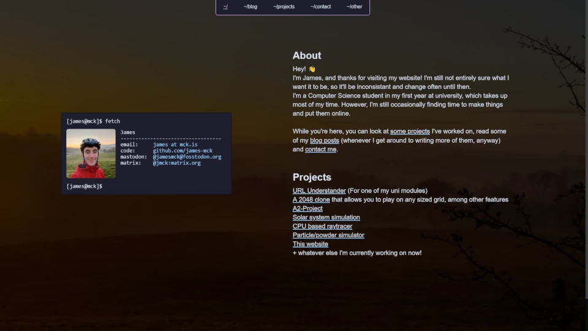
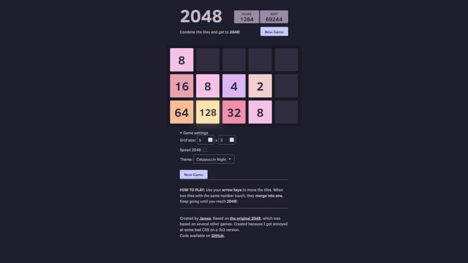
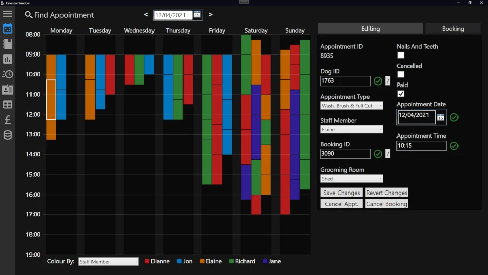
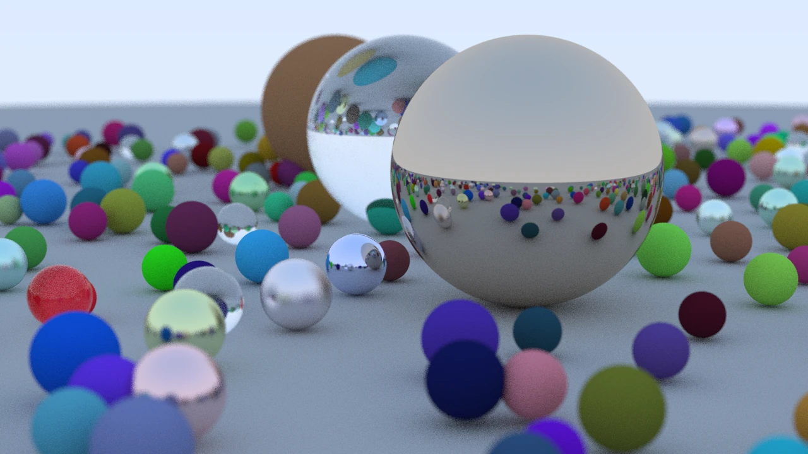

# Projects

A list of most of the projects I've worked on, mostly personal projects with a few from university

## Personal website

The website you're currently browsing! Created from scratch by me, and optimised to be as minimal as possible.
(The main page is under 50kb!) Several of the main pages, like this one, were created by hand, with some (e.g.
blog posts) being generated automatically from markdown using another program I created ([WebGenJava](#WebGenJava)).

[Code here](https://codeberg.org/james-mck/pages)

## 2048 clone

A significantly modified version of the original 2048, with new features including:

- Allowing boards of any size
- Support for theming, including a dark mode
- Additional challenges, such as an extra tile being added every second - Slightly tidier code, making use of updates
  to javascript and CSS since the release of the original version

Made for fun to improve on an existing project and gain some more experience with browser javascript

[Code here](https://github.com/James-McK/2048), and [playable here](https://2048.mck.is/)!

## CSC1028

The project I created for the CSC1028 module I opted to do, providing all sorts of metadata on a given URL. See my{" "}
[blog post](https://mck.is/CSC1028/) on it for a lot more info.

[Code here](https://github.com/James-McK/PlanetPhysics)

## Last Stand Text Adventure

A text adventure made as a group project for out CSC1030 module. I created the majority of the CSS for the layout, along with
the temperature and typewriter systems used by all other group members. I also worked with them to create the inventory and
timer systems also used throughout the game.

[Code here](https://github.com/James-McK/LastStand), [playable here](https://last-stand.mck.is/)!

## A2 Project

This application was my A2 coursework project for Software Systems Development, written between 10/11/2020 and 14/03/2021 using
C# and WPF. See the [git repo](https://github.com/James-McK/A2-Project) for more details and features

This is still a project I'm very proud of - It's got a few minor flaws, but it has some features I put a lot of work into and
I'm very happy with the end result.

[Code here](https://github.com/James-McK/A2-Project)

## Driver

An application I wrote from scratch with several parts:

- A 2D driving simulation that actually feels fun to drive around in
- A system for creating and improving genetic neural networks written entirely from scratch to allow me to better understand how
  simple networks like that actually function

... the end result of which is networks which can drive a car pretty well based on only a few sensors (5 distances to the edge
of the track at different angles)

<a href="https://github.com/James-McK/MonoGameDriver">Code on gtiea</a>

### CPU-based raytracer

A multithreaded CPU ray tracer written in C#. Based on the "Ray Tracing in One Weekend" book. Features:

- Reflections (inc. reflections of reflections) - Refraction (e.g. light passing through glass spheres)
- Accurate shadows
- Depth of field
- Multithreaded for significantly increaded performance

Although performance could significantly be improved by offloading the GPU (Which is better suited for that kind of workload) it
was still a very fun project to work on

[Code here](https://github.com/James-McK/RTWeekend)

## Particle/powder toy simulator

A small particle/powder toy simulator. Very basic - its flaws are definitely noticable if you're looking for them - but I still
enjoyed messing around with this kind of cellular automaton

[Code here](https://github.com/James-McK/ParticleSim)

## PlanetPhysics

An [n-body](https://en.wikipedia.org/wiki/N-body_problem) physics simulator built for fun as a side project.  
Currently uses the rather inaccurate [Euler method](https://en.wikipedia.org/wiki/Euler_method) for integration (this
is mostly mitigated by using very small step sizes), but ideally it should use something like the Runge-kutta methods for better
accuracy.  
Includes several pre-set situations, including a fictional but nice-looking system (shown below), a stable 3-body figure-8
system, a binary star system, and our solar system to scale (with and without moons)

[Code here](https://github.com/James-McK/PlanetPhysics)

## Catppuccin-MusicBee

A theme for the MusicBee music player based on the very nice [catpuccin](https://github.com/catppuccin/catppuccin) colour palette

[Code here](https://github.com/James-McK/Catppuccin-MusicBee)

## WebGenJava

The program I wrote to convert markdown to the HTML you're currently viewing. Although there are already existing solutions that
offer this sort of functionality (eg [pandoc](https://pandoc.org/)), I wanted something that gave me slightly more
control over the result.

[Code here](https://github.com/James-McK/WebGenJava) (Please, don't use it)
