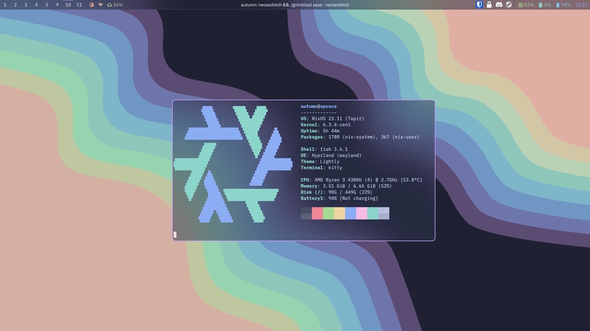
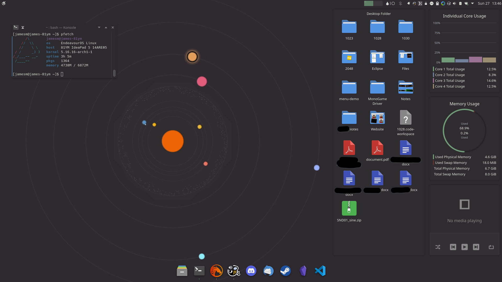

# Hardware/software I use

I always enjoy hearing other people talk about what hardware/software they use, so here's my current setup and some thoughts on it! It's also interesting for me to look back and see how what I use has changed over time.

## Hardware

### Desktop (Built Summer 2019)

**CPU**: Ryzen 5 3600x. A very nice CPU, I've definitely enjoyed its performance! Should have just gone for the non-x version and saved £50 though.  
**GPU**: RTX 2060 - More than good enough for playing indie games, which is most of what I do these days. (Although Minecraft with shaders is capable of bringing anything to its knees!)  
**Motherboard**: B450 Tomahawk - Good I/O, works well! Picked because of its BIOS flashback feature.  
**RAM**: To sound fancy I'd say 16gb Micron E-die running at 3466MT/s, but ultimately RAM is RAM  
**Case**: Fractal Meshify C. High airflow gives me a quiet PC, and it looks good!

**Screen**: Second-hand 1080p 60Hz VA (Not perfect, but hard to beat for the price of free)  
**Keyboard**: Ducky One 2 Horizon w/ Cherry MX Brown switches - A very nice keyboard I enjoy typing on! (Yes, not everybody likes brown switches, but I've not compared them to much else in that area so I like them)  
**Mouse**: Logitech G502 HERO - I like it a lot but wouldn't recommend it, as I'm now on my seccond - the first developed serious issues with double clicking when it shouldn't  
**Headphones**: Beyerdynamic DT 990s - Very nice open back headphones! Comfy and they sound good.

### Laptop

Lenovo IdeaPad 14ARE05 which I got back in 2020 for ~£400, which was an amazing deal.

The 4300u is an excellent CPU, gives great battery life (+ a 47Wh battery!) while performing well enough for my needs. It's great for whatever university work needs done and a bit of indie games and emulation on the side. I've since bought another 512gb of storage to add to the 128gb I bought it with.

Maybe I'll eventually look into what Framework are up to with more repairable laptops, but I plan on keeping this laptop for as long as I can, it's been great!

### Phone

Currently using a Samsung Z Flip 4 which I received from a family member who was switching back to iOS. After using it for a couple of months I'm still not sure I see the advantages of a smaller folding phone like this? Still a very nice phone otherwise though, so I'm happy to keep it!

Previously I was using a OnePlus 7t. It was a really nice phone in a lot of ways, but the quality of support from OnePlus wasn't great, and it became buggier over time with some features, like running two apps side by side on the top and bottom of the screen, breaking completely after an update and never being fixed after many months. I've since installed LineageOS and keep it around and set up in case I need it as a backup phone.

I used to use iOS, but after using Android for a few years now I don't think I can ever go back. The extra freedom and customisation android gives is perfect for me.

## Software

I'm currently using Linux on both my desktop and laptop (with a backup Windows install on the 128gb drive on my laptop just in case I need it for anything)  
On my laptop, I'm currently experimenting with Hyprland on NixOS.

### Previous setups

Here's a screenshot of a previous version of my setup on my laptop:

Here's some of the software I ran when I was using Windows:  
Wallpaper Engine, Rainmeter, Open-Shell (Fluent-Metro skin), Microsoft PowerToys, Notepad++, MusicBee, f.lux, Everything (Voidtools)

